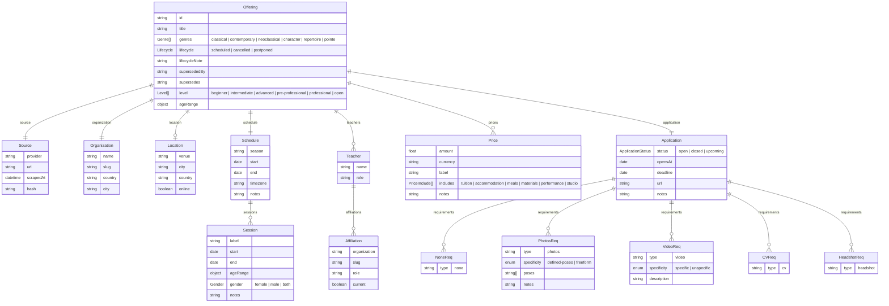

# Entity-relationship diagram

Generated from the Pydantic models in `src/intensive_dance/models.py` — **do not edit by hand**. Regenerate after a model change with `uv run python -m intensive_dance.erd --write` (CI fails on drift). Companion to [`data-model.md`](./data-model.md), which is the prose source of truth.

