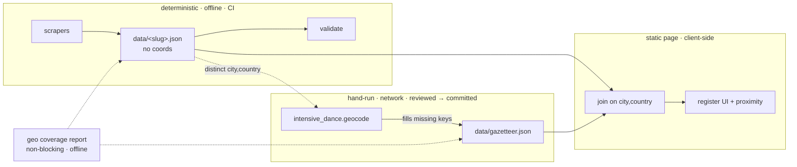
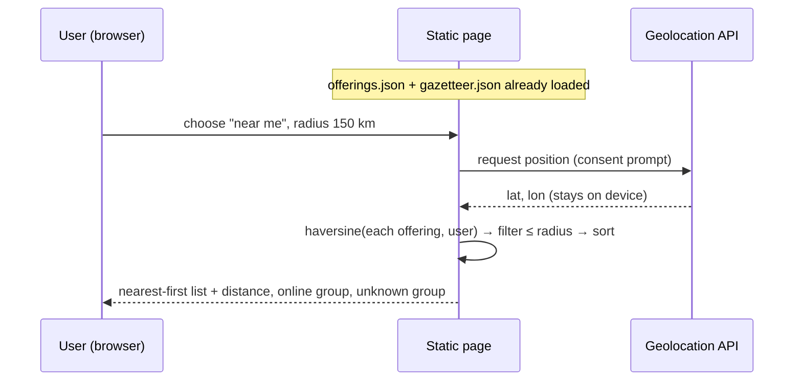

# Solution Design — Location-aware discovery ("intensives near a place")

| | |
|---|---|
| **Key** | IDR-73 (proposed) |
| **Status** | Built — backend feed here; UI extracted to `ha1des/intensive-dance-ui` |
| **Type** | Consumer feature (data backend publishes a feed; UI is a separate repo) |
| **Author / PO** | T.-F. Pluto |
| **Depends on** | the committed store (`data/*.json`) + `data/gazetteer.json`; UI = separate repo `ha1des/intensive-dance-ui` |
| **Touches data model** | yes — adds a *derived* gazetteer; canonical store stays scrape-pure |

---

## 1. Problem & context

The register already answers *"what intensives exist?"* but not *"which ones can I
realistically get to?"*. Today a family can only read a worldwide list and eyeball the
`city · country-code` on each row. For the real decision — *"can my
child attend this without an unreasonable journey, and can we combine it with where we already
need to be?"* — the user has to know geography by heart and scan 300+ rows by hand.

Grounding facts (store snapshot 2026-06-15):

- **311 offerings**, 310 with a `location`, 1 `online`, 1 with no location.
- **101 distinct `(city, country)`**, **122 distinct venues**, **36 countries**.
- `Location = { venue?, city?, country?, online? }` — **no coordinates today** (`models.py`).
- The store is **deterministic and scrape-pure**: a no-op re-scrape must yield no git diff,
  tests run offline, and nothing non-deterministic/network-bound may enter the scrape/hash path
  (same rule that keeps LLM calls out of `scrape()`).
- The consumer is a **single static page** over committed JSON — **no backend**.

The 101-city number is the key enabler: geocoding *our* data is a one-time, tiny, committable
job. The only thing that must be resolved at runtime is the *user's own* location.

---

## 2. User Story (improved)

### Epic

> **IDR-73 — Location-aware discovery.** Let a family find intensives by *proximity to a place
> that matters to them*, not just by reading a global list.

### Primary story

> **As** a parent planning my child's intensive season — or the aspiring dancer myself —
> **I want to** discover intensives within a travel range I choose around a place that matters to
> me (my home, a city we'll already be visiting, or relatives we could stay with), sorted by
> distance and combinable with dates, genre and level,
> **so that** I can build a *shortlist I can actually attend* instead of scanning a worldwide
> list city by city.

### Split into INVEST-sized stories

| # | Story | Value |
|---|---|---|
| US‑1 | *Near me*: from my current location, show intensives within a radius, nearest first. | the "I'm here, what's reachable" case |
| US‑2 | *Near a place*: pick a reference city/country and see what's within range of it. | plan around a trip / family / a parent's home base |
| US‑3 | *Radius & sort*: adjust the range and order results by distance. | tune "reachable" to my own tolerance |
| US‑4 | *Combine*: layer proximity on top of the existing genre / level / season filters. | "contemporary, this summer, within 200 km" |
| US‑5 | *Online & unknown*: online intensives and location-unknown ones are handled honestly, not silently dropped by a radius filter. | faithful to the data |
| US‑6 | *Plan signals*: each result shows distance + the facts that drive a travel decision (dates, deadline, whether accommodation is included). | decide, not just find |
| US‑7 | *Shareable view*: the filtered/located result is a deep link. | parent ↔ dancer hand-off |

**Acceptance of the epic** = US‑1…US‑6 met for the MVP scope in §4; US‑7 is a thin add-on.

---

## 3. Use cases / scenarios (Gherkin)

```gherkin
Background:
  Given the register of intensives with per-offering city/country (and coordinates from the gazetteer)
  And all distance computation happens in the browser (no location ever leaves the device)

# UC1 — Near me
Scenario: Dancer finds reachable intensives from where they are
  Given I grant the browser location permission
  When I choose "near me" and set the radius to 150 km
  Then I see only intensives whose venue/city is within 150 km
  And they are ordered nearest-first with the distance shown on each row
  And online intensives are listed in a separate "Online" group

Scenario: User declines location permission
  Given I do not grant location permission
  When I choose "near me"
  Then I am asked to pick a reference city instead
  And no error blocks the rest of the page

# UC2 — Near a chosen place
Scenario: Parent plans around a city they will visit
  Given I type or pick "Vienna, AT" as the reference place
  When I set the radius to 300 km
  Then results include Vienna plus nearby cross-border cities (e.g. Budapest, Munich)
  And each row shows its distance from Vienna

Scenario: Reference place not in our known list
  Given I type a place we cannot resolve offline
  Then I am offered the nearest known reference cities
  And (phase 2) an optional one-off lookup I must explicitly trigger

# UC3 — Radius & sort
Scenario: Widen the search when nothing is in range
  Given a reference place with no intensives within 100 km
  When the result set is empty
  Then I am prompted to widen the radius (e.g. "nothing within 100 km — try 250 km?")
  And the nearest few beyond the radius are previewed

# UC4 — Combine with existing filters
Scenario: Proximity plus genre plus season
  Given reference place "Frankfurt, DE", radius 250 km
  When I also select genre "contemporary" and season "summer 2026"
  Then only contemporary summer-2026 intensives within 250 km remain, nearest first

# UC5 — Online & unknown, handled honestly
Scenario: Online and location-unknown are not dropped
  Given a radius filter is active
  Then online intensives appear in their own group regardless of radius
  And any location-unknown intensive appears under "location not stated", never silently hidden

# UC6 — Plan signals on each result
Scenario: Enough to decide, not just to find
  When I view a result row
  Then it shows distance, dates, application deadline, and whether accommodation is included

# UC7 — Shareable
Scenario: Parent sends a located shortlist to the dancer
  When I have a place + radius + filters applied
  Then the URL encodes them so opening the link reproduces the same view
```

---

## 4. Functional scope

**In (MVP):**
- Reference location via (a) **browser geolocation** ("near me") or (b) a **known reference
  city/country** chosen from our own list.
- **Radius** control + **distance** column + **nearest-first** sort.
- **Compose** with the existing genre / level / season filters and free-text search.
- Honest handling of **online** and **location-unknown** offerings.
- Per-result **planning signals** already in the model (dates, deadline, `accommodation` in
  `Price.includes`).
- **URL-encoded** state (place, radius, filters) for deep links.

**Out (later phases):**
- Venue-level precision everywhere (MVP geocodes at **city** granularity; venue precision is a
  data refinement, see §7).
- Free-text geocoding of *arbitrary* user input (needs a runtime geocoder — privacy/§6).
- **Map view**, travel-time/isochrones, public-transport routing.
- Personal accounts / saved searches / alerts.

---

## 5. Solution architecture

### 5.1 Principle: geocoding is enrichment, never part of the scrape

Geocoding is network-bound and non-deterministic — exactly what must stay out of `scrape()`
(same rule as LLM calls). So:

- The canonical **`data/<slug>.json` stays coordinate-free**. Scrapers are untouched; the
  no-diff/offline guarantees are preserved.
- A **committed gazetteer** `data/gazetteer.json` maps each `(city, country)` (and, later,
  `venue`) to `{ lat, lon, precision, source }`. ~101 city keys today → a tiny, reviewable file.
- A **hand-run enrichment helper** `intensive_dance.geocode` fills only the *missing* keys
  (idempotent), using a geocoder (e.g. OSM/Nominatim) under the same "dev/enrichment helper whose
  output you review and commit as static data" rule already in AGENTS.md. Never called in CI's
  scrape path.
- A **coverage report** (`intensive_dance.geo`) is offline and lists which `(city, country)` in
  the store still lack coordinates. It is **deliberately not a blocking gate step**: scrapers are
  added constantly and in parallel, so a PR that introduces a provider in a new city must not be
  held hostage to geocoding (geocoding is decoupled enrichment). The consumer fails soft (a
  city without coords lands in the "location unknown" group), and a later `geocode` run tops the
  gazetteer up. `geo --check` (non-zero exit on gaps) exists for opt-in use by the geocode flow or
  a future audit-issue job (mirroring `scraper-audit.yml`).



### 5.2 Data model changes

- **No change to `Location`** for MVP — coordinates live in the **separate gazetteer**, joined by
  `(city, country)` in the consumer. Rationale: keeps the canonical store scrape-pure and the
  no-diff guarantee intact; avoids writing derived/volatile data back into per-provider files.
- **New committed artifact** `data/gazetteer.json` (sorted-key, deterministic) — its own small
  Pydantic model + a line in `validate.py`.
- *Optional future:* an opt-in `geo: { lat, lon, precision } | null` on `Location`, populated
  **only** by the enrichment step (never the scraper). Defer until/unless a consumer needs coords
  inlined per offering. If adopted, regenerate `schema/offering.schema.json` + `docs/erd.md`
  (CI drift-checks both).

### 5.3 Consumer query (all client-side)

- The page loads the offerings JSON + `gazetteer.json`, joins each offering to coordinates by
  `(city, country)`, and computes the **haversine** distance to the reference point in JS.
- Filter by `distance ≤ radius`; sort ascending by distance; render the distance per row.
- **Online** offerings bypass the radius (own group). **Location-unknown** offerings render in a
  "location not stated" group. **Past** cycles stay derived consumer-side (`schedule.end < today`),
  unchanged by this feature.
- Reference point resolution:
  - *Near me* → `navigator.geolocation` (explicit consent), kept in memory only.
  - *Near a place* → resolved against `gazetteer.json` locally (we already have the cities).
  - *(P2)* arbitrary free-text → optional, user-triggered external lookup (see §6).



### 5.4 Frontend UX (in the UI repo `ha1des/intensive-dance-ui`)

**Where it lives:** the UI is the **separate private repo `ha1des/intensive-dance-ui`** (static page,
no backend). *This* repo (the data backend) publishes the feed via `intensive_dance.bundle`
(`--out ../intensive-dance-ui/data.json`, or stdout); the page `fetch`es that `data.json`. Keeping
the UI out of the backend keeps the latter a clean, API-first data product.

- Add to the existing filter bar: a **location control** ("📍 Near me" | "Near a place ▾" with a
  datalist of known cities) and a **radius** slider/stepper (e.g. 50 / 100 / 250 / 500 / 1000 km /
  "any"). Reuse the existing chip/pill styling.
- Each row gains a **distance** chip next to the existing `city · cc`. Add a small **distance**
  sort option to the current sort control.
- Empty-in-radius state → the "widen radius" prompt with a nearest-few preview (UC3).
- All controls reflect into the **URL query string** (`?near=vienna-at&radius=300&genre=contemporary`)
  for deep links (US‑7).

---

## 6. Non-functional

- **Privacy / GDPR (deliberate advantage).** A static, backend-less design means the user's
  location is processed **entirely on their device and never transmitted** — no server log, no
  tracking, no PII. Given the audience is **EU parents and minors**, this is both a compliance
  win and on-brand (honest, premium, neutral). The browser's own consent prompt is the only gate
  for "near me". Any future free-text geocoder (P2) must be explicitly user-triggered and
  disclosed, because it sends the typed place to a third party.
- **Determinism preserved.** Scrape path and hashing untouched; gazetteer is committed static
  data; CI stays offline (coverage check is a pure set comparison).
- **Performance.** 311 offerings × haversine is trivial in JS; no index needed at this scale.
  Two small JSON loads. Recompute on control change is instant.
- **Accessibility / i18n.** Distances in km (metric; the audience is EU-centric) with a possible
  mi toggle later; controls keyboard-navigable; the location control degrades gracefully when
  geolocation is denied/unavailable (UC1 fallback).
- **Faithfulness.** Radius never *silently* removes online/unknown offerings (US‑5) — the register
  must not appear to "hide" courses just because a coordinate is missing.

---

## 7. Phasing

- **MVP (this design):** city-level gazetteer; "near me" + known-city reference; radius + distance
  sort; compose with existing filters; online/unknown handling; plan signals; deep-link state.
- **P2 — precision & reach:** venue-level geocoding (122 venues) for sharper distances; optional
  user-triggered free-text geocoding for arbitrary places (with the §6 disclosure); a **map view**.
- **P3 — real travel planning:** travel-time/isochrones, "stay-over vs. day-trip" hints driven by
  `Price.includes` accommodation, multi-stop season planning.

---

## 8. Risks & open questions

| # | Risk / question | Handling |
|---|---|---|
| R1 | City-only distance is coarse (a city's venue can be tens of km off). | Fine for "is it reachable?"; venue precision is P2. State the granularity in the UI ("distance to city"). |
| R2 | Gazetteer rots when new scrapes add cities. | `geo --check` reports gaps, but is **not** a blocking gate (scraper PRs aren't held hostage to geocoding); consumer fails soft to "location unknown"; a later `geocode` run tops up. A daily audit-issue (like `scraper-audit.yml`) is the natural "don't rot" home if needed. |
| R3 | Geocoder licensing/rate limits (Nominatim usage policy). | One-off, cached, committed; respect rate limits in the hand-run helper; attribute OSM. |
| R4 | Cross-border "near" needs cities we may not host. | Reference set can include major hubs even without an offering there; revisit if users want arbitrary places (→ P2 free-text). |
| Q1 | Default radius and unit? | Proposed default 250 km / km. Confirm. |
| Q2 | Inline `geo` on `Location` later, or keep the join-only gazetteer? | Default to join-only; only inline if a second consumer needs it. |
| Q3 | Is a map in-scope for the first release or strictly P2? | Proposed P2 to keep MVP a pure list enhancement. |

---

## 9. Cross-link / business synergy

Location-aware planning is precisely the moment a family commits to an *away* intensive — the same
moment they need audition photos/videos to apply. The feature stays neutral and free (register
ethos), but it surfaces the exact intent the photography business serves; no in-register selling.

---

## 10. Definition of Done (MVP)

**PR 1 — data foundation (this PR):**
- [x] `data/gazetteer.json` (101 cities, bbox-reviewed) + `geo` model & helpers + `validate.py`
      parses it; `geo` coverage report available (non-blocking by design).
- [x] `intensive_dance.geocode` enrichment helper (idempotent, hand-run Nominatim, kept out of CI).
- [x] `AGENTS.md` note: geocoding is enrichment-only (never in `scrape()`); gazetteer is the
      coords source; coverage report is non-blocking.

**PR 2 — feed + UI (extracted to `ha1des/intensive-dance-ui`):**
- [x] `intensive_dance.bundle` produces the consumer feed (live offerings + joined coords) into
      the UI repo's `data.json` (or stdout); `tests/test_bundle.py` covers the projection.
- [x] UI repo: register page with location control (📍 near me / city picker), radius, distance
      chips, online/unknown groups, empty-in-radius prompt with nearest-3 preview, URL state.
      UC1–UC7 exercised via a DOM harness; **visual review pending**.
- [x] `concept/` removed from this repo; `AGENTS.md` records that the UI lives in the separate
      repo and the backend publishes the feed.
```
